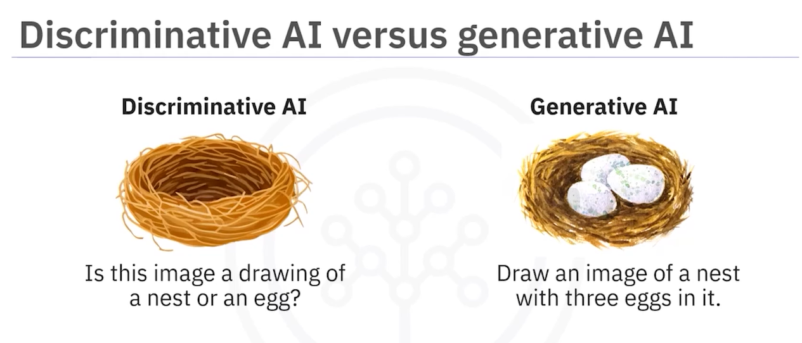
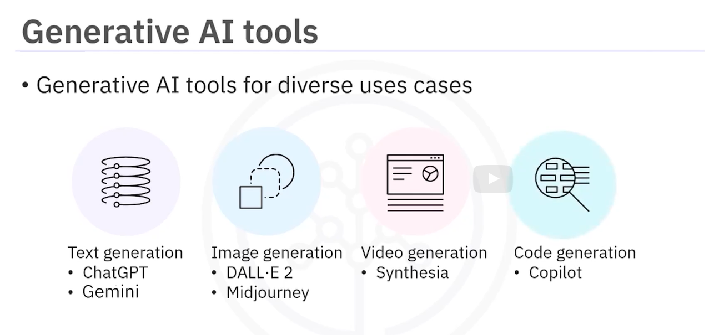

# Introduction to Generative AI 

> https://learning.edx.org/course/course-v1:IBM+AI0121EN+3T2023/block-v1:IBM+AI0121EN+3T2023+type@sequential+block@ecc104e7ede84ebeac8a282db5b00e8f/block-v1:IBM+AI0121EN+3T2023+type@vertical+block@2e1f1bd210ee4d08ba9d64df6d815feb

## Nav
> * Generative AI: A Tool For The Future.
>    * Basic Content Creation
>    * Wriring Copy
>    * Image And Video Generation
>    * Analyzing Market Data
> * Other Side:
>    * Artifical Intelligence
>    * Machine Learning
>    * Deep Learning
> * Can I Use:
>    * Applications
>    * Concepts
>    * Tools
>    * Models

## First Step
> introduction to generative ai
> 

## Core Goals
> Generative artificial intelligence (AI) is all set to transform the future of our society, impacting every facet of our work and daily lives.

> This course is your first step toward understanding the capabilities of generative AI powered by different models, including large language models (LLMs). Whether you are an enthusiast, a student, or a professional, this course provides a foundation to use generative AI for diverse use cases.

> In this course, you will learn about the fundamentals and evolution of generative AI. You will explore the capabilities of generative AI in different domains, including text, image, audio, video, virtual worlds, code, and data. You will understand the applications of Generative AI across different sectors and industries. You will learn about the capabilities and features of common generative AI models and tools, such as GPT, DALL-E, Stable Diffusion, and Synthesia. 

> Hands-on labs, included in the course, provide an opportunity to explore the use cases of generative AI through IBM Generative AI Classroom and popular tools like ChatGPT. You will also hear from the practitioners about the capabilities, applications, and tools of Generative AI.

> After completing this course, you will be able to:

> * Describe generative AI and distinguish it from discriminative AI.
> * Describe the capabilities of generative AI and its use cases in the real world.
> * Identify the applications of generative AI in different sectors and industries.
> * Explore common generative AI models and tools for text, code, image, audio, and video generation.

## Tips
* https://learning.edx.org/course/course-v1:IBM+AI0121EN+3T2023/block-v1:IBM+AI0121EN+3T2023+type@sequential+block@fe97182d56cd493f84b972855f3e42ae/block-v1:IBM+AI0121EN+3T2023+type@vertical+block@9ada3a9604ea4ced8ef8d5a701873944  (must look, can read it many!!!)

> LLMs === Large Language Models --> 中文: 大型语言模型
> GPT === Generative Pre-trained Transformer --> 中文: 生成式预训练变换器
> DALL-E === Deep Artifical Language Evolution --> 中文: 深度人工语言进化
> Stable Diffusion === 稳定扩散 --> 中文: 稳定扩散

